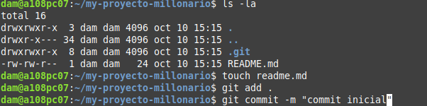

<div>

# Manipulación avanzada en git (trabajo con tags y ramas)
## Alumna: Melissa Ruiz González

Vamos a crear un repositorio en GitHub que se llame "my-proyecto-millonario" https://github.com/mruizgl/my-proyecto-millonario
- Creamos repositorio


- Clonamos repositorio en Git
  


- Hacemos un commit inicial


- Subimos los cambios al repositorio remoto utilizando
```
git push origin main
```


- Crear en el repositorio local un fichero llamado __privado.txt__ y una carpeta llamada __privada__. Realizar los cambios oportunos para que tanto el archivo como la carpeta sean ignorados por git.


## Añadir fichero 1.txt y añadir un tag v.0.1
- Añadir fichero 1.txt al repositorio local.
```
touch 1.txt
git add .
git commit -m "añadido 1.txt"
```
- Crear un tag v0.1.
- Subir los cambios al repositorio remoto.


## Crear una rama v0.2
- Crear una rama v0.2.
```
git branch v0.2
```
- Posiciona tu carpeta de trabajo en esta rama.
```
git checkout v0.2
```


## Añadir fichero 2.txt
- Añadir un fichero 2.txt en la rama v0.2.


## Crear rama remota v0.2
- Subir los cambios al reposiorio remoto.
```
git push origin v0.2
```


## Merge directo
- Posicionarse en la rama master/main según sea tu rama principal y hacer un merge de la rama v0.2 en la rama master/main.


## Merge con conflicto
- En la rama maste/main poner Hola en el fichero 1.txt y hacer commit.
```
git checkout master
echo "Hola" >> 1.txt
git add .
git commit -m "hola en 1.txt"
```


- Posicionarse en la rama v0.2 y poner Adios en el fichero "1.txt" y hacer commit.


- Posicionarse de nuevo en la rama main y hacer un merge con la rama v0.2


## Listado de ramas
- Listar las ramas con merge y las ramas sin merge.
```
git branch --merged
git branch --no-merged
```
## Arreglar conflicto 
- Arreglar el conflicto anterior y hacer un commit.
```
vim 1.txt
git add .
git commit -m "arreglado merge en 1.txt"
```


## Borrar rama
- Crear un tag v0.2
```
git tag v0.2
```
- Borrar la rama v0.2
```
git branch -d v0.2
```


## Listado de cambios 
- Listar los distintos commits con sus ramas y sus tags.
```
git config --global alias.list 'log --oneline --decorate --graph --all'
git list
```


- Por último hago push de todo a main con git push origin main para que se actualice en el repositorio remoto todos los cambios que hemos hecho desde el último push.
</div>
